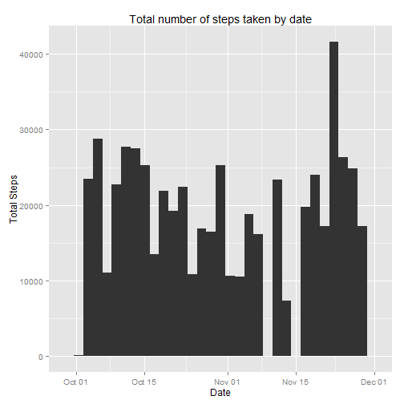
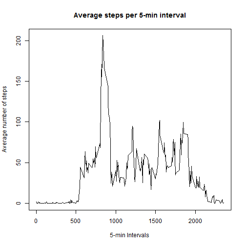
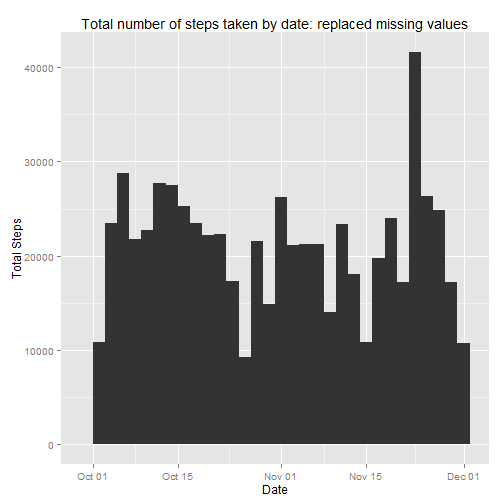
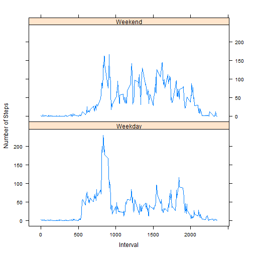

####Loading and preprocessing the data


```r
data <- read.csv("activity.csv", header=TRUE)
data$date <- as.Date(data$date)
```


###Question 1: What is mean total number of steps taken per day?


```r
library(plyr)
library(ggplot2)

#Make a histogram of the total number of steps taken each day
#Calculate and report the mean and median total number of steps taken per day

data1 <- data[complete.cases(data),]
output1 <- ddply(data1, "date", summarize, check=sum(steps))
mean1 <- mean(output1$check)
median1 <- median(output1$check)

#Plot histogram
plot1 <- qplot(date, data=output1, weight=check, geom="histogram")
plot1 + labs(title = "Total number of steps taken by date")  +  labs(x="Date", y="Total Steps")
```

```
## stat_bin: binwidth defaulted to range/30. Use 'binwidth = x' to adjust this.
```

 

####The mean number of steps per day are 1.0766 &times; 10<sup>4</sup>.

####The median of number of steps per day is 10765.


###Question 2: What is the average daily activity pattern?


```r
#Make a time series plot (i.e. type = "l") of the 5-minute interval (x-axis) and the average number of steps taken, averaged across all days (y-axis)

output2 <- ddply(data1, "interval", summarize, check=mean(steps))
plot(output2$interval,output2$check, type="l", main="Average steps per 5-min interval", xlab="5-min Intervals", ylab="Average number of steps")
```

 

```r
# Which 5-minute interval, on average across all the days in the dataset, contains the maximum number of steps?
ans <- subset(output2, output2$check==max(output2$check))
```

####The 5-minute interval that  contains the maximum number of steps (on average across all the days in the dataset) is 835


###Question 3: Imputing missing values

####Total number of rows with "NAs" are 2304

The same Histogram of number of steps per day, with all NAs replaced by mean for that day, will be as shown below


```r
#Devise a strategy for filling in all of the missing values in the dataset. The strategy does not need to be sophisticated. For example, you could use the mean/median for that day, or the mean for that 5-minute interval, etc.

#Create a new dataset that is equal to the original dataset but with the missing data filled in.

newdf <- ddply(data, "interval", function(df) {df$steps[is.na(df$steps)] <- mean(df$steps, na.rm=TRUE); return(df)})

#Make a histogram of the total number of steps taken each day and Calculate and report the mean and median total number of steps taken per day. 

output3 <- ddply(newdf, "date", summarize, check=sum(steps))
mean2 <- mean(output3$check)
median2 <- median(output3$check)

#Plot histogram
plot2 <- qplot(date, data=output3, weight=check, geom="histogram")
plot2 + labs(title = "Total number of steps taken by date: replaced missing values")  +  labs(x="Date", y="Total Steps")
```

```
## stat_bin: binwidth defaulted to range/30. Use 'binwidth = x' to adjust this.
```

 

####The mean number of steps per day with imputed NAs becomes 1.0766 &times; 10<sup>4</sup>.

####The median of number of steps per day with imputed NAs becomes 1.0766 &times; 10<sup>4</sup>.


Do these values differ from the estimates from the first part of the assignment? 

####After Imputing NAs, the change in mean value is 0 and that of median value is -1.1887

#####The impact of imputing missing data on the estimates of the total daily number of steps is that while the number on dates with no NAs does not change, the number of steps shown for dates with NAs increases to the imputed value.


###Question 4: Are there differences in activity patterns between weekdays and weekends?

```r
# Create a new factor variable in the dataset with two levels - "weekday" and "weekend" indicating whether a given date is a weekday or weekend day

newdf$weekday <- weekdays(newdf$date)

newdf$weekday[newdf$weekday=="Monday"|newdf$weekday=="Tuesday"|newdf$weekday=="Wednesday"|newdf$weekday=="Thursday"|newdf$weekday=="Friday"] <- "Weekday"

newdf$weekday[newdf$weekday=="Saturday"|newdf$weekday=="Sunday"] <- "Weekend"

newdf <- transform(newdf, weekday=factor(weekday))

#Make a panel plot containing a time series plot (i.e. type = "l") of the 5-minute interval (x-axis) and the average number of steps taken, averaged across all weekday days or weekend days (y-axis). See the README file in the GitHub repository to see an example of what this plot should look like using simulated data.

library(dplyr)
by_wi <- group_by(newdf, interval, weekday)
summ <- summarize(by_wi, mean(steps))
colnames(summ)[3] <- "mean"
```

A time-series plot of average number of steps taken within each of the 5-minute intervals by Weekdays and weekends is shown below


```r
library(lattice)
xyplot(mean ~ interval | weekday, data=summ, layout=c(1,2), type="l", xlab="Interval", ylab="Number of Steps")
```

 

####There is a distinct difference in the pattern on average number of steps by weekday vs weekend

##Thank You
